# Dependencies

The main Rust SRI stack is split across two monorepos:
- [`sv2-apps`](https://github.com/stratum-mining/sv2-apps): high-level application crates
- [`stratum`](https://github.com/stratum-mining/stratum): low-level foundational crates

All crates across these two repositories follow a well-defined dependency hierarchy:

```mermaid
%%{init: {
  'theme': 'base',
  'themeVariables': {
    'background': '#0b1220',
    'primaryColor': '#111827',
    'primaryTextColor': '#f8fafc',
    'primaryBorderColor': '#e2e8f0',
    'lineColor': '#93c5fd',
    'secondaryColor': '#0f172a',
    'tertiaryColor': '#111827',
    'clusterBkg': '#1f2937',
    'clusterBorder': '#94a3b8',
    'edgeLabelBackground': '#0f172a'
  },
  'flowchart': {
    'curve': 'linear',
    'nodeSpacing': 55,
    'rankSpacing': 95,
    'padding': 12
  }
}}%%
flowchart BT
  subgraph STR["stratum repo (low-level crates)"]
    direction BT

    subgraph STR_L0["Layer 0: foundations"]
      direction LR
      derive["derive_codec_sv2"]
      buffer["buffer_sv2"]
      noise["noise_sv2"]
    end

    subgraph STR_L1["Layer 1: wire primitives"]
      direction LR
      binary["binary_sv2"]
      framing["framing_sv2"]
      sv1["sv1_api"]
    end

    subgraph STR_L2["Layer 2: protocol messages"]
      direction LR
      common["common_messages_sv2"]
      job["job_declaration_sv2"]
      mining["mining_sv2"]
      template["template_distribution_sv2"]
      ext["extensions_sv2"]
    end

    subgraph STR_L3["Layer 3: composition"]
      direction LR
      codec["codec_sv2"]
      channels["channels_sv2"]
      parsers["parsers_sv2"]
      translation["stratum_translation"]
    end

    subgraph STR_L4["Layer 4: handlers"]
      direction LR
      handlers["handlers_sv2"]
    end

    subgraph STR_L5["Layer 5: facade"]
      direction LR
      core["stratum-core"]
    end
  end

  subgraph APPS["sv2-apps repo (application crates)"]
    direction BT

    subgraph APPS_L0["Layer A0: shared libraries"]
      direction LR
      sapps["stratum-apps"]
      bcsv2["bitcoin_core_sv2"]
    end

    subgraph APPS_L1["Layer A1: app crates"]
      direction LR
      jdc["jd_client_sv2"]
      tr["translator_sv2"]
      jds["jd_server_sv2"]
      pool["pool_sv2"]
    end

    subgraph APPS_L2["Layer A2: integration"]
      direction LR
      it["integration_tests_sv2"]
    end
  end

  classDef l0 fill:#0b1220,stroke:#94a3b8,stroke-width:2px,color:#e2e8f0;
  classDef l1 fill:#082f49,stroke:#38bdf8,stroke-width:2px,color:#e2e8f0;
  classDef l2 fill:#431407,stroke:#fb923c,stroke-width:2px,color:#e2e8f0;
  classDef l3 fill:#2e1065,stroke:#a78bfa,stroke-width:2px,color:#e2e8f0;
  classDef l4 fill:#052e2b,stroke:#2dd4bf,stroke-width:2px,color:#e2e8f0;
  classDef l5 fill:#3f3f46,stroke:#fde047,stroke-width:2.5px,color:#fefce8;
  classDef appsA1 fill:#052e16,stroke:#22c55e,stroke-width:2px,color:#dcfce7;
  classDef appsA2 fill:#082f49,stroke:#60a5fa,stroke-width:2.2px,color:#dbeafe;
  classDef appsCore fill:#450a0a,stroke:#f43f5e,stroke-width:2.5px,color:#ffe4e6;

  class derive,buffer,noise l0;
  class binary,framing,sv1 l1;
  class common,job,mining,template,ext l2;
  class codec,channels,parsers,translation l3;
  class handlers l4;
  class core l5;
  class jdc,tr,jds,pool appsA1;
  class it appsA2;
  class sapps,bcsv2 appsCore;

  style STR fill:#111827,stroke:#cbd5e1,stroke-width:1.5px
  style APPS fill:#111827,stroke:#cbd5e1,stroke-width:1.5px
  style STR_L0 fill:#0b1220,stroke:#155e75,stroke-width:1.5px
  style STR_L1 fill:#0b2038,stroke:#38bdf8,stroke-width:1.5px
  style STR_L2 fill:#2a140a,stroke:#fb923c,stroke-width:1.5px
  style STR_L3 fill:#241238,stroke:#a78bfa,stroke-width:1.5px
  style STR_L4 fill:#0d2522,stroke:#2dd4bf,stroke-width:1.5px
  style STR_L5 fill:#27272a,stroke:#facc15,stroke-width:1.5px
  style APPS_L0 fill:#2a0f16,stroke:#f43f5e,stroke-width:1.5px
  style APPS_L1 fill:#14532d,stroke:#22c55e,stroke-width:1.5px
  style APPS_L2 fill:#0b2038,stroke:#60a5fa,stroke-width:1.6px

  derive --> binary
  buffer -. "with_buffer_pool" .-> binary
  noise --> framing
  binary --> framing
  buffer -. "with_buffer_pool" .-> framing
  binary --> codec
  framing --> codec
  buffer --> codec
  noise -. "noise_sv2 feature" .-> codec

  binary --> common
  binary --> job
  binary --> mining
  binary --> template
  binary --> ext
  binary --> sv1

  binary --> channels
  mining --> channels
  template --> channels

  binary --> parsers
  framing --> parsers
  common --> parsers
  job --> parsers
  mining --> parsers
  template --> parsers
  ext --> parsers

  parsers --> handlers
  framing --> handlers
  common --> handlers
  job --> handlers
  mining --> handlers
  template --> handlers
  ext --> handlers
  binary --> handlers

  sv1 --> translation
  mining --> translation
  channels --> translation
  binary --> translation

  binary --> core
  buffer --> core
  noise --> core
  framing --> core
  codec --> core
  common --> core
  job --> core
  mining --> core
  template --> core
  ext --> core
  channels --> core
  parsers --> core
  handlers --> core
  sv1 -. "sv1 feature" .-> core
  translation -. "translation feature" .-> core

  core -. "git/cargo dep" .-> sapps
  core -- "git/cargo dep" --> bcsv2

  sapps --> jdc
  sapps --> tr
  sapps --> jds
  sapps --> pool
  sapps --> it

  bcsv2 --> jdc
  bcsv2 --> jds
  bcsv2 --> pool

  jds --> pool
  jdc --> it
  tr --> it
  pool --> it

  linkStyle 0,1,2,3,4,14 stroke:#38bdf8,stroke-width:2.2px,opacity:0.95
  linkStyle 9,10,11,12,13 stroke:#fb923c,stroke-width:2.2px,opacity:0.95
  linkStyle 5,6,7,8,15,16,17,18,19,20,21,22,23,24,33,34,35,36 stroke:#a78bfa,stroke-width:2.2px,opacity:0.95
  linkStyle 25,26,27,28,29,30,31,32 stroke:#2dd4bf,stroke-width:2.2px,opacity:0.95
  linkStyle 37,38,39,40,41,42,43,44,45,46,47,48,49,50,51 stroke:#fde047,stroke-width:2.3px,opacity:0.98
  linkStyle 52,53 stroke:#f43f5e,stroke-width:2.4px,opacity:1
  linkStyle 54,55,56,57,59,60,61,62 stroke:#22c55e,stroke-width:2.4px,opacity:1
  linkStyle 58,63,64,65 stroke:#60a5fa,stroke-width:2.5px,opacity:1

  linkStyle 0,1,3,14 stroke:#38bdf8,stroke-width:4.6px,opacity:1
  linkStyle 5,6,7,8,18 stroke:#a78bfa,stroke-width:4.6px,opacity:1
  linkStyle 37,38,39,40,41,42,43,44,45,46,47,48,49,50,51 stroke:#fde047,stroke-width:4.8px,opacity:1
  linkStyle 52,53 stroke:#f43f5e,stroke-width:4.8px,opacity:1
  linkStyle 54,55,57,62 stroke:#22c55e,stroke-width:4.6px,opacity:1
```

```mermaid
flowchart TB
  subgraph LEG["Arrow Legend"]
    direction TB

    subgraph L1[" "]
      direction LR
      d1(( )) -. "feature-gated dependency" .-> d2(( ))
    end

    subgraph L2[" "]
      direction LR
      r1(( )) -- "private dependency" --> r2(( ))
    end

    subgraph L3[" "]
      direction LR
      p1(( )) == "public dependency" ==> p2(( ))
    end
  end

  style LEG fill:#0b1220,stroke:#cbd5e1,stroke-width:1.5px
  style L1 fill:transparent,stroke:transparent
  style L2 fill:transparent,stroke:transparent
  style L3 fill:transparent,stroke:transparent
```

Please note that the diagrams above are meant to be rendered via [Mermaid](https://mermaid.ai/). Github renders it automatically.
If you're reading this file somewhere else, you may need to use a Mermaid renderer to view the diagrams as intended.
