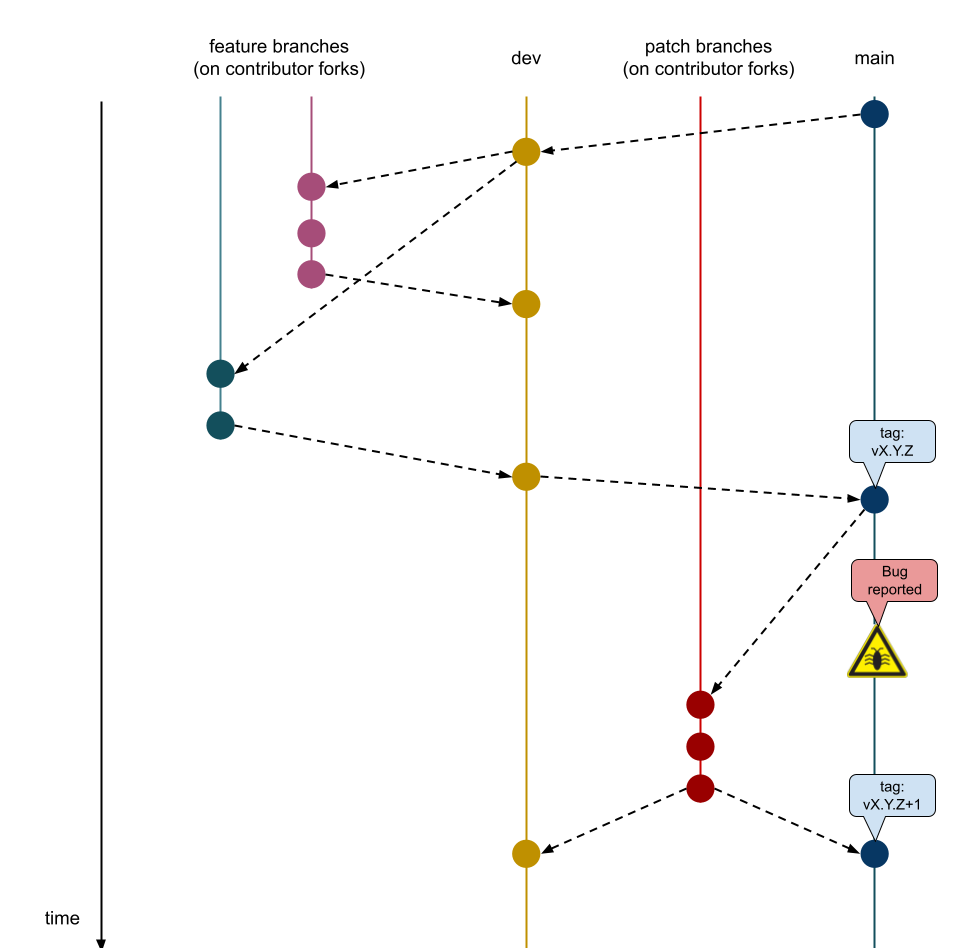

# Versioning

SRI releases follow [SemVer 2.0.0](https://semver.org/).

Given a version number `MAJOR.MINOR.PATCH`, we increment the:
- `MAJOR` version when incompatible API changes are introduced
- `MINOR` version when functionality is added in a backward compatible manner
- `PATCH` version when backward compatible bug fixes are introduced

SRI has a global version, which uses git tags and keeps track of how the codebase evolves across time as a whole.

Every internal SRI crate also follows SemVer 2.0.0, but each crate version is only set on the respective `Cargo.toml`,
(no git tags), and it evolves independently of the global release version.

Whenever a `PATCH` is introduced, it is applied to all the latest `MAJOR` releases.
For example: imagine there's releases `v1.0.0`, `v1.1.0`, and `v2.0.0`. A bug is found, dating back all the way to `v1.0.0`.
A patch is applied such that the following new tags are introduced: `v1.1.1` and `v2.0.1`.

# Git Branching Strategy

We follow a simplified [gitflow](https://nvie.com/posts/a-successful-git-branching-model/) branching strategy.

Although our strategy is very similar to the classic gitflow model, we do not keep release branches.

## Principal Branches

The SRI repo holds two principal branches with an infinite lifetime:
- `main`
- `dev`

We consider `main` to be the branch where the source code of `HEAD` always reflects the latest release.

We consider `dev` to be the branch where the source code of `HEAD` always reflects the latest changes in the development cycle.

The SRI team will decide the appropriate time when the changes to `dev` are merged back into `main` and then tagged with a release number while bumping `MAJOR`, `MINOR`, or `PATCH`.

## Feature Branches

New features are developed into separate branches that only live in the contributor's forks.

- branch off from: `dev`
- merge back into: `dev`
- naming convention: `feat-x`, where `x` describes the feature

## Patch Branches

Bugs are patched into separate branches that only live in the contributor's forks.

- branch off from: `dev`
- merge back into: `dev`
- naming convention: `patch-x`, where `x` describes the bug/patch

# Releasing Roles Binaries

The [release page of SRI repo](https://github.com/stratum-mining/stratum/releases) provides executable binaries for all SRI roles, targeting popular hardware architectures.

The GitHub binary releases of the roles are handled in the `release-bin.yaml` workflow.

This workflow is manually started by navigating to the "Actions" tab in the SRI repo, then navigating to the Release workflow section, and clicking "Run Workflow".

Note: in order to be able to manually trigger the "Run Workflow" button, the user needs to have "Write" permissions on the repository, otherwise the button will not show up on the UI.

# Publishing Library Crates

Although SRI has a global release cycle, which is attached to the binaries, each internal crate also has its own versioning history.

Lib crates are published to crates.io in the `release-lib.yaml` workflow. The workflow tries to update all the library crates. 

If a crate is not updated successfully, the step will fail, but since all steps have `continue-on-error` set to true, the workflow will continue.

Since steps can fail, the output of the action must be manually checked.

Every PR to `main` needs to increase the version of whatever crate it is touching. Otherwise, we will mess up the dependency chain of whoever is fetching from crates.io

Manually running `cargo release` in the various workspaces helps to prepare the version number before the releases are published.

Every time we bump some crate's version, `release-libs.yaml` needs to be manually triggered in order to update crates.io.
