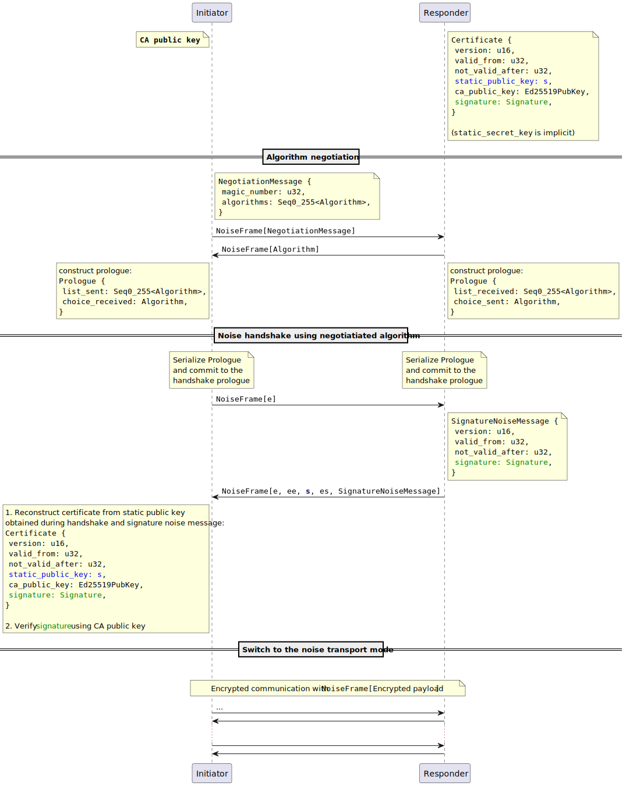

# Noise encryption guide
Stratum V2 security is based on [Noise protocol](https://noiseprotocol.org/noise.html).
There are 2 phases of the encrypted session initialization:
1. Algorithm negotiation that should be used for authenticated encryption once the session is initialized 
2. [NX Noise handshake](https://noiseprotocol.org/noise.html#interactive-handshake-patterns-fundamental)

During these two phases we say the connection is in *Handshake State*
After finishing the noise handshake, encrypted session is established. This is called *Transport State*.

## Noise messages, serialization and framing
Each message that is sent between negotiating parties is serialized into a byte array that is sent through the
wires as a **NoiseFrame** with 2-Bytes little-endian length prefix.

### Primitives and their serialization

Messages consist of primitives and are serialized as sequence of values.
Primitives used during noise session are following:

#### Numbers
* Number such as `u32`, `u16` etc. are serialized as little-endian.
* `MAGIC_NUMBER` used in NegotiationMessage is a constant that is fixed to `MAGIC_NUMBER = 861033555`
  (where 861033555 corresponds to LE the binary representation `b"STR3"`

#### Seq0_255 
* sequence of max length 255
* prefixed 1 Byte with length information followed by given number of serialized items.

#### Static public key
* is part of noise handshake message. It's fixed size array given by the handshake algorithm.
* not prefixed

#### Signature
* ed25519 signature
* 64-bytes array
* not prefix

#### SignatureNoiseMessage
* sequence of `u16`, `u32`, `u32` and `Signature` that represent version, valid_from, not_valid_after and signature
  fields used by Initiator to reconstruct the certificate and validate authenticate the Responder.

#### Algorithm
* u32 number indicating [noise protocol name](http://noiseprotocol.org/noise.html#protocol-names).
* There are currently 2 supported protocols:
  * `Noise_NX_25519_AESGCM_BLAKE2s` - encoded with number 1196639553 (which in binary form corresponds to `b"AESG"`)
  * `Noise_NX_25519_ChaChaPoly_BLAKE2s` - encoded with number 1212368963 (which in binary form corresponds to `b"CHCH"`)
* After the algorithm negotiation phase finishes, both Initiator and Responder use the negotiated name to perform
  handshake and establish encrypted session

#### Prologue
* Serialized as `Seq0_255<Algorithm>` followed by `Algorithm`
* Serialized form is not sent directly through connection. Instead, it is committed to the handshake
  state through [prologue](http://noiseprotocol.org/noise.html#prologue) (more on that later).
  This is done to ensure the integrity during the negotiation phase. If both parties end up committing
  different prologues, handshake will fail.


### Example
Following picture shows example serialization of NegotiationMessage with list of two algorithms.


## Algorithm negotiation
Algorithm negotiation can be considered a zero'th step in the handshake.
1. Initiator sends an initial message containing list algorithm that it supports.
2. Server chooses one of them and sends its choice back.

First NegotiationMessage contains magic_number that is constant and fixed `MAGIC_NUMBER = 861033555`.

Servers response contains only single algorithm choice, i. e. u32.

## NX handshake
After the negotiation phase is finished both parties construct prologues from the exchanged messages
and commit it to the handshake state. Both must be identical, otherwise handshake fails. This provides
integrity for the negotiation phase.

Responder is initialized with `Certificate`.
Certificate contains validity timestamps and server's static public key that is used during noise handshake. It is
signed with Certification Authority whose public key is known to initiator.

By validating the signature, initiator knows that the entity that it just performed handshake with and that
it is about to start sending hash rate to *is approved* by the Certification Authority.

Handshake steps:
1. Initiator sends ephemeral key within NoiseFrame (exact format follows from handshake algorithm and is mostly taken
  care of by the library implementing Noise protocol)
2. Responder sends their ephemeral and static public keys, performs Diffie-Hellman handshake provides an
  encrypted `SignatureNoiseMessage` as a noise handshake payload (see noise specification). SignatureNoiseMessage
  contains information necessary to reconstruct the certificate and validate the signature.
3. If all handshake operations are successful and Certificate Signature is successfully validate against
  CA public key, handshake phase if finished and encrypted session can be switched to *Transport State*



## Test vectors:
keys are encoded using checked-base58.

Test authority keypair:
```json
{
  "public": "2BGDpgySfGGF5tsDdXGqwC9qyUkbyPLkgqTWB55tA3vobbsXbq",
  "secret": "SbpqzWZPsj5c8X6BNzYSvgBEqwcGMhrCWeHCbbTn5aSDtPZ8F"
}
```

Test server static keypair:
```json
{
  "public": "2gJayqSdwyRFhLvdcwvm1v4fEVfZxYBhqbnh6xpifd2vmztFvG",
  "secret": "2NtnYtvyvAhrpSpyPwaB7MoVsQURXMavZBrqDAcU4kHHzvor5e"
}
```

Test Certificate:
```json
{
  "version": 0,
  "valid_from": 1661358236,
  "not_valid_after": 2006958236,
  "noise_public_key": "2gJayqSdwyRFhLvdcwvm1v4fEVfZxYBhqbnh6xpifd2vmztFvG",
  "authority_public_key": "2BGDpgySfGGF5tsDdXGqwC9qyUkbyPLkgqTWB55tA3vobbsXbq",
  "signature": "DEvFcgFhqsYa3dZUB91NxRK3EJXwQF5wNLpt6V47zC8nVxbNiUMntHPQhgAL9aos6H8agUqkWTAcyL3dX1M51PYVnxUn1"
}
```

Test SignatureNoiseMessage
```json
{
  "version": 0,
  "valid_from": 1661358236,
  "not_valid_after": 2006958236,
  "signature": "DEvFcgFhqsYa3dZUB91NxRK3EJXwQF5wNLpt6V47zC8nVxbNiUMntHPQhgAL9aos6H8agUqkWTAcyL3dX1M51PYVnxUn1"
}
```

Communication (all representations are hexadecimal and **don't** contain the NoiseFrame 2B length prefix):
```
Initiator ... Responder
// Negotiation message (magic + 1 element array of algorithm
-> "535452330141455347"

// algorithm
<- "41455347"

// e
-> "a8455c21efbbb85dd21ba23f5f6decbc744c4541295c8935fd45354a8010d860"

// e, ee, s, es, signature_noise_message
// Note that everything coming after the first 'ee' (which is DH operation) is encrypted as described
// by the noise specification
<- "1766d2ed023a2ab710d268a848695fcb1b37ecb3082f3a558a605b343878d04ba5f5d5f384df420eba603a7d19ddf46f7\
    de0bb14fadd2577a9c5df7440d81c813eebcc04f3bffefed8fe5aa5dd5f9f79b0a30da7f749650c1e9488ba4a557e55f2\
    f27ae2a81d282faa981366c2ac06cad4cb190b17d01134a4c316ca5abf020cc1611666fedb98d07cac94966f1d1f3768d\
    4c8df18dbf55110822b512dbee2f7c11f7bb39be625274933"
```
