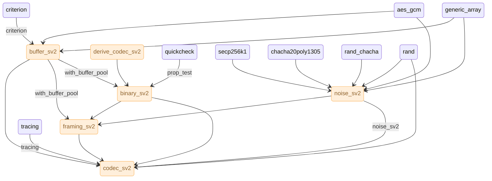
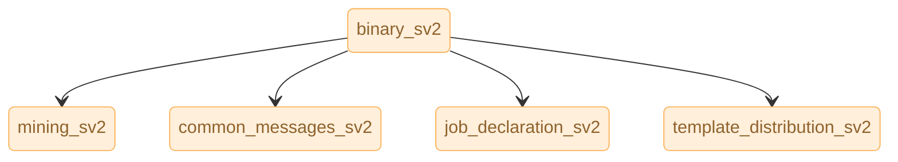
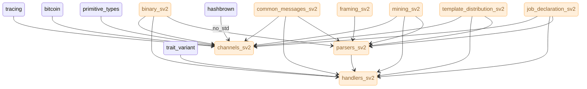

# Low Level

```mermaid
stateDiagram-v2
  classDef Peach stroke-width:1px,stroke-dasharray:none,stroke:#FBB35A,fill:#FFEFDB,color:#8F632D;

  generic_array --> noise_sv2
  generic_array --> buffer_sv2
  criterion --> buffer_sv2: criterion

  derive_codec_sv2 --> binary_sv2
  quickcheck --> binary_sv2: prop_test
  buffer_sv2 --> binary_sv2: with_buffer_pool

  secp256k1 --> noise_sv2
  aes_gcm --> noise_sv2
  chacha20poly1305 --> noise_sv2
  rand_chacha --> noise_sv2
  aes_gcm --> buffer_sv2

  buffer_sv2 --> framing_sv2: with_buffer_pool
  noise_sv2 --> codec_sv2: noise_sv2
  noise_sv2 --> framing_sv2

  framing_sv2 --> codec_sv2
  binary_sv2 --> codec_sv2
  binary_sv2 --> framing_sv2
  buffer_sv2 --> codec_sv2
  rand --> codec_sv2
  rand --> noise_sv2
  tracing --> codec_sv2: tracing

  class noise_sv2,buffer_sv2,derive_codec_sv2,binary_sv2,framing_sv2,codec_sv2 Peach
```

# SubProtocols

```mermaid
stateDiagram-v2
  classDef Peach stroke-width:1px,stroke-dasharray:none,stroke:#FBB35A,fill:#FFEFDB,color:#8F632D;

  binary_sv2 --> mining_sv2

  binary_sv2 --> common_messages_sv2

  binary_sv2 --> job_declaration_sv2

  binary_sv2 --> template_distribution_sv2

  class mining_sv2,common_messages_sv2,job_declaration_sv2,binary_sv2,template_distribution_sv2 Peach
```

# High Level

```mermaid
stateDiagram-v2
  classDef Peach stroke-width:1px,stroke-dasharray:none,stroke:#FBB35A,fill:#FFEFDB,color:#8F632D;

  binary_sv2 --> channels_sv2
  common_messages_sv2 --> channels_sv2
  mining_sv2 --> channels_sv2
  template_distribution_sv2 --> channels_sv2
  job_declaration_sv2 --> channels_sv2
  tracing --> channels_sv2
  bitcoin --> channels_sv2
  primitive_types --> channels_sv2
  hashbrown --> channels_sv2: no_std

  trait_variant --> handlers_sv2
  parsers_sv2 --> handlers_sv2
  binary_sv2 --> handlers_sv2
  common_messages_sv2 --> handlers_sv2
  mining_sv2 --> handlers_sv2
  template_distribution_sv2 --> handlers_sv2
  job_declaration_sv2 --> handlers_sv2

  binary_sv2 --> parsers_sv2
  framing_sv2 --> parsers_sv2
  common_messages_sv2 --> parsers_sv2
  mining_sv2 --> parsers_sv2
  template_distribution_sv2 --> parsers_sv2
  job_declaration_sv2 --> parsers_sv2

  class mining_sv2,common_messages_sv2,job_declaration_sv2,binary_sv2,template_distribution_sv2,framing_sv2,channels_sv2,handlers_sv2,parsers_sv2 Peach
```
